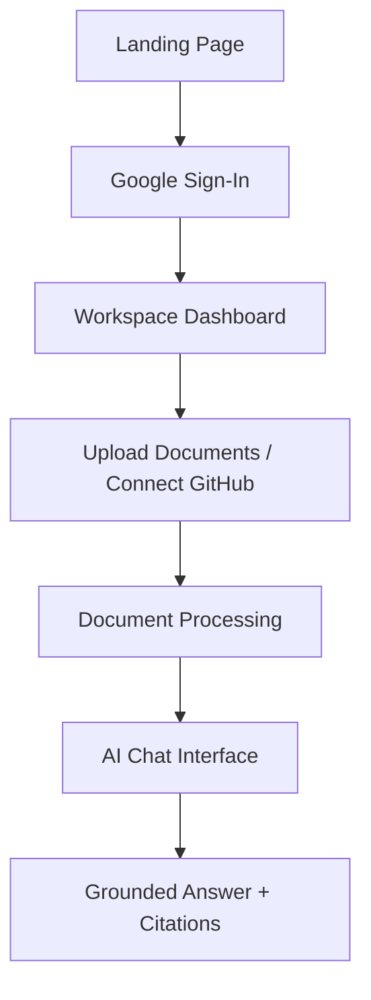

# Lumora Product Requirements Document (PRD)

**Version:** 1.0  
**Status:** Draft  
**Prepared By:** Nanda Gopal D

---

## Table of Contents
1. Product Overview
2. Vision Statement
3. Problem Statement
4. Product Goals
5. Target Users
6. User Personas
7. User Stories
8. User Journey
9. MVP Scope
10. Feature Prioritization
11. Functional Requirements
12. Non-Functional Requirements
13. Success Metrics
14. Risks
15. Assumptions
16. Product Roadmap
17. Competitive Positioning
18. Product Principles

---

## 1. Product Overview
KnowledgeOS is an AI-powered enterprise knowledge platform that enables users to unify documents, repositories, and external knowledge sources into a single searchable workspace. Instead of manually searching across PDFs, GitHub repositories, and cloud storage, users can ask questions in natural language and receive grounded, citation-backed responses generated using Retrieval-Augmented Generation (RAG).

KnowledgeOS is designed as a production-oriented SaaS platform with a modular architecture, extensible connectors, and support for future enterprise integrations.

## 2. Vision Statement
To create a unified AI knowledge platform that enables individuals and teams to retrieve organizational knowledge quickly, accurately, and securely using natural language.

## 3. Problem Statement
Modern knowledge is fragmented across PDFs, GitHub repositories, Google Drive, Notion, and internal documentation. Existing search tools rely heavily on keywords, require users to know where information is stored, and often return irrelevant results.

KnowledgeOS addresses these challenges through semantic search and conversational AI backed by source citations.

## 4. Product Goals
### Primary Goals
- Provide conversational access to knowledge.
- Reduce information retrieval time.
- Generate citation-backed AI responses.
- Demonstrate a production-grade RAG architecture.

### Secondary Goals
- Support multiple data sources.
- Maintain a modular architecture.
- Enable future enterprise expansion.

## 5. Target Users
### Primary
- Software Developers
- AI Engineers
- Students
- Researchers

### Secondary
- Startup Teams
- Product Managers
- Technical Writers
- Small Businesses

### Future
- Enterprises
- Educational Institutions

## 6. User Personas
### Software Developer
**Needs**
- Search project documentation
- Ask questions about repositories
- Understand existing codebases

**Pain Points**
- Documentation spread across repositories
- Manual searching
- Outdated information

### Student
**Needs**
- Upload study materials
- Ask questions
- Summarize notes

**Pain Points**
- Large volumes of content
- Difficult revision
- Time-consuming search

### Startup Team
**Needs**
- Centralized knowledge
- Shared documentation
- AI-assisted search

**Pain Points**
- Knowledge silos
- Context switching
- Duplicate documentation

## 7. User Stories
- Sign in with Google.
- Access a personal workspace.
- Upload documents for semantic search.
- Ask natural-language questions.
- Connect GitHub repositories and query documentation.

## 8. User Journey

## 9. MVP Scope
### Included
- Google OAuth Login
- Personal Workspace
- PDF Upload
- GitHub Connector
- AI Chat
- Semantic Search
- Citation-backed Responses
- Conversation History

### Excluded
- Team Collaboration
- Organizations
- Billing
- Slack Integration
- Notion Integration
- Google Drive Integration
- OCR
- Mobile Application

## 10. Feature Prioritization
### Must Have
- Google Authentication
- Workspace
- PDF Upload
- Semantic Search
- AI Chat
- Citations
- GitHub Connector

### Should Have
- Conversation History
- Document Metadata
- Search Filters
- Background Processing

### Could Have
- Google Drive
- Notion
- Prompt Templates
- Search Analytics

### Won't Have (v1)
- Billing
- RBAC
- Team Workspaces
- Voice Assistant
- Mobile App

## 11. Functional Requirements
The system shall:
- Authenticate users with Google OAuth.
- Create personal workspaces.
- Upload and process documents.
- Index document embeddings.
- Retrieve relevant knowledge.
- Generate grounded AI responses.
- Provide citations.
- Maintain chat history.

## 12. Non-Functional Requirements
- **Performance:** Average response time below 5 seconds.
- **Availability:** Cloud deployed and publicly accessible.
- **Scalability:** Support future connectors and LLM providers.
- **Security:** JWT authentication, workspace isolation, HTTPS.
- **Maintainability:** Modular architecture and service-oriented backend.

## 13. Success Metrics
### Product Metrics
- Successful login rate
- Document upload success rate
- Query success rate
- Average response latency
- Citation coverage

### User Metrics
- Time to first answer
- Session retention
- Average queries per session

### Technical Metrics
- API uptime
- Search accuracy
- Retrieval latency
- Embedding generation time

## 14. Risks
### Technical
- LLM API rate limits
- Vector database downtime
- Large document processing delays

### Product
- Low-quality uploaded documents
- Poor retrieval quality
- Incorrect citations

### Operational
- Free-tier infrastructure limitations
- Third-party API quota changes

## 15. Assumptions
- Users have Google accounts.
- Uploaded documents are text-based.
- Free-tier cloud services are sufficient for MVP.
- GitHub repositories are accessible with appropriate permissions.

## 16. Product Roadmap
### Version 1.0
- Google OAuth
- PDF Upload
- GitHub Connector
- AI Chat
- Semantic Search
- Citations

### Version 1.5
- Google Drive Connector
- Notion Connector
- Background Synchronization
- Search Filters

### Version 2.0
- Team Workspaces
- Organization Support
- Slack Integration
- Analytics Dashboard
- RBAC

### Version 3.0
- MCP Integration
- LangGraph Agent Workflows
- Multi-Agent Knowledge Retrieval
- AI Workspace Automation
- Enterprise Connectors

## 17. Competitive Positioning

| Feature | Lumora | Traditional Search | Basic Chat with PDF |
|---|:---:|:---:|:---:|
| Semantic Search | ✅ | ❌ | ✅ |
| Multi-Source Knowledge | ✅ | ❌ | ❌ |
| Citation-Based Responses | ✅ | ❌ | Varies |
| GitHub Integration | ✅ | ❌ | ❌ |
| Modular Connector Framework | ✅ | ❌ | ❌ |
| Workspace Isolation | ✅ | ❌ | Rare |
| Production-Oriented Architecture | ✅ | ❌ | ❌ |

## 18. Product Principles
1. **Grounded Responses:** Every AI answer is backed by retrievable source content.
2. **Simple User Experience:** Authentication, upload, and search require minimal effort.
3. **Extensible Architecture:** New connectors and AI providers can be integrated easily.
4. **Provider Independence:** The platform is not tied to a single LLM vendor.
5. **Production Readiness:** The architecture supports deployment, maintainability, and future scalability.
